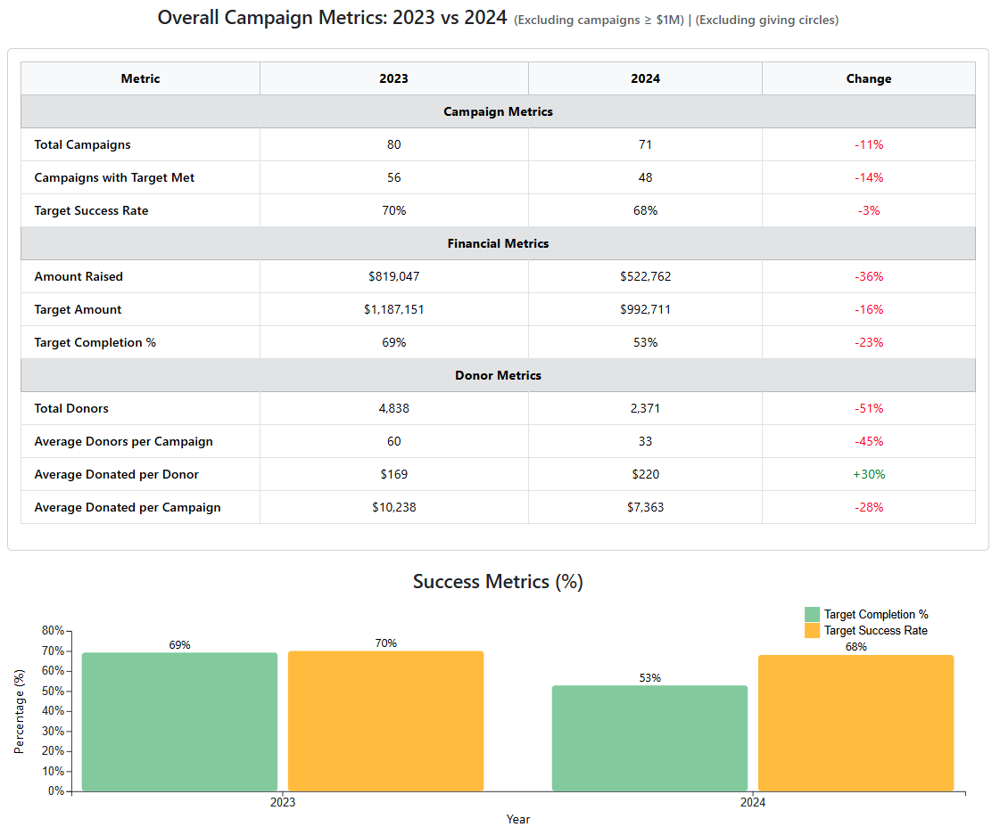

# Ray of Hope Analysis



This repository contains tools for scraping and analyzing crowdfunding campaigns from charitable platforms including Ray of Hope and G2C (Giving2Children).

## Project Overview

This project comprises two main components:
1. **Web Scrapers**: Python scripts to collect campaign data from charity websites
2. **Data Visualization Dashboard**: A React application with D3.js visualizations to analyze campaign performance metrics

**Live Dashboard**: [https://yingxuan99.github.io/RoH_Analysis/](https://yingxuan99.github.io/RoH_Analysis/)

## 🌐 Web Scrapers

The `web_scrapers` directory contains Python scripts that scrape campaign data from different charitable platforms:

- `RoH_scraper.py` - Scrapes Ray of Hope campaigns
- `RoH_detail_scraper.py` - Collects detailed information about Ray of Hope campaigns
- `G2C_scraper.py` - Scrapes campaigns from the Children's Society G2C platform

### Data Collection Process

The scrapers collect the following information:
- Campaign titles and URLs
- Target amounts and funds raised
- Campaign dates (start/end)
- Number of donors
- Campaign categories
- Completion percentages
- Days remaining

This data is saved in Excel format with several versions:
- `ray_of_hope_campaigns_all.xlsx` - All campaigns including duplicates across categories
- `ray_of_hope_campaigns_unique.xlsx` - Deduplicated campaigns with combined category information
- `ray_of_hope_campaigns_detailed.xlsx` - Enhanced dataset with additional details
- `G2C_campaigns.xlsx` - Campaigns from the G2C platform

## 📊 Data Visualization Dashboard

The React application provides interactive visualizations of campaign metrics using D3.js for data-driven document manipulation.

### Key Features

- Overall campaign metrics comparing 2023 vs 2024
- Campaign success rate analysis
- Monthly campaign distribution trends
- Metrics by beneficiary category
- Metrics by primary fundraising category
- Platform comparison (Ray of Hope vs G2C)
- Filtering capabilities for data exploration

### Pages & Components

- `RayOfHopeAnalysis.jsx` - Main analysis component for Ray of Hope campaigns
- `PlatformComparison.jsx` - Comparative analysis between platforms
- Various visualization components using D3.js:
  - `D3BarChart`
  - `MetricsTableD3` 
  - `MonthlyTrendsLineChart`
  - `UnifiedD3Analysis`

## 🚀 Getting Started

### Prerequisites

- Node.js (v14 or higher)
- Python 3.7+
- pip (Python package manager)

### Installation

1. Clone the repository:
   ```
   git clone https://github.com/YingXuan99/RoH_Analysis
   cd ray-of-hope-analysis
   ```

2. Install Python dependencies for web scraping:
   ```
   pip install requests beautifulsoup4 pandas openpyxl
   ```

3. Install Node.js dependencies for the dashboard:
   ```
   npm install
   ```

### Running the Web Scrapers

```bash
cd web_scrapers
python RoH_scraper.py     # Scrape basic Ray of Hope data
python RoH_detail_scraper.py    # Scrape detailed Ray of Hope data
python G2C_scraper.py     # Scrape G2C data
```

### Running the Dashboard

```bash
npm start
```

The dashboard will be available at http://localhost:3000, and the deployed version is at [https://yingxuan99.github.io/RoH_Analysis/](https://yingxuan99.github.io/RoH_Analysis/)

## 📁 Project Structure

```
ray-of-hope-analysis/
├── build/               # Production build files
├── node_modules/        # Node.js dependencies
├── public/              # Public assets
│   └── dashboard_screenshot.png  # Dashboard screenshot
├── src/                 # React source code
│   ├── components/      # React components
│   │   ├── D3BarChart.jsx
│   │   ├── FilterControls.jsx
│   │   ├── MetricsTableD3.jsx
│   │   ├── MonthlyTrendsLineChart.jsx
│   │   └── UnifiedD3Analysis.jsx
│   └── App.js           # Main application component
├── web_scrapers/        # Python scraping scripts
│   ├── G2C_campaigns.xlsx
│   ├── G2C_scraper.py
│   ├── RoH_detail_scraper.py
│   ├── RoH_scraper.py
│   ├── ray_of_hope_campaigns_all.xlsx
│   ├── ray_of_hope_campaigns_detailed.xlsx
│   └── ray_of_hope_campaigns_unique.xlsx
├── .gitignore           # Git ignore file
├── package-lock.json    # NPM package lock
├── package.json         # NPM configuration
└── README.md            # This file
```

## 📊 Analysis Features

The dashboard provides several analytical features:

1. **Fundraising Efficiency Analysis**:
   - Percentage of target amount raised
   - Success rate metrics by category

2. **Category Analysis**:
   - Performance by primary and beneficiary categories
   - Year-over-year comparisons

3. **Temporal Trends**:
   - Monthly distribution of campaign starts
   - Campaign longevity analysis

4. **Platform Comparison**:
   - Compare metrics between Ray of Hope and G2C platforms
   - Focusing on children's campaigns for fair comparison

5. **Filtering Options**:
   - Toggle for completed campaigns only
   - Toggle to exclude outliers (campaigns ≥ $1M)
   - Toggle to exclude giving circles

## 🔧 Technologies Used

- **Web Scraping**: Python, BeautifulSoup4, Requests
- **Data Processing**: Pandas, NumPy
- **Frontend**: React, D3.js
- **Styling**: CSS, Bootstrap
- **Build Tools**: npm, webpack

## 🙏 Acknowledgements

- Ray of Hope and G2C for their important charitable work